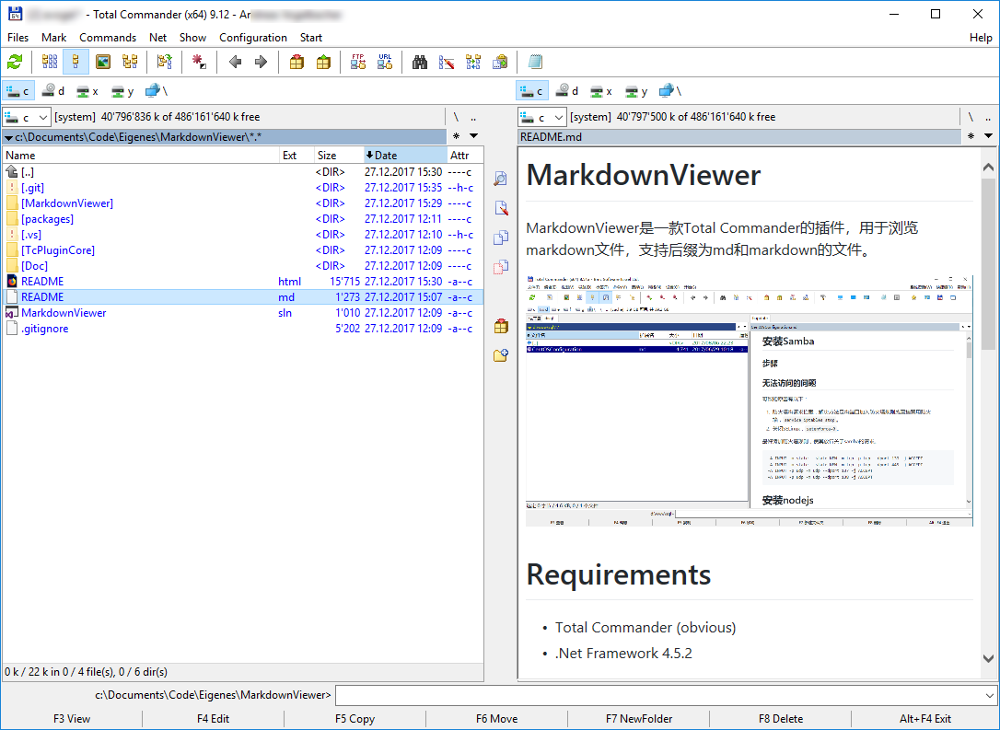

# MarkdownViewer

MarkdownViewer是一款Total Commander的插件，用于浏览markdown文件，支持后缀为md和markdown的文件。

# Requirements
- Total Commander (obvious)
- .Net Framework 4.5.2

# User installation
1. Download TCdotNetInterface-1.4.zip from [TC .NET Interface](https://sourceforge.net/projects/tcdotnetinterface/)
2. Install TcPluginSetup.msi from "TCdotNetInterface-1.4.zip\Deployment\" (this installs globally the "TC .NET Interface": TcPluginTools.dll and TcPluginInterface.dll)
3. Open complied Plugin-Zip in Total Commander, as usual, and install plugin

# Developers Information

## Compiling
1. Edit TcPluginCore\WrapperBuilder.exe.config to match your paths (ZIP is needed to pack the plugin)
2. Open project in Visual Studio and Compile

## Libraries
Used libraries are:
- [TC .NET Interface](https://sourceforge.net/projects/tcdotnetinterface/) - License: MIT
- [MarkDig](https://github.com/lunet-io/markdig) - License: BSD 2

## Aditional Tools
For compiling you also need:
- Visual Studio 2017
- A Zip Packer eg. [Info-Zip](http://www.info-zip.org/)

# Revisions
- 1.0.0.0 Original
- 1.0.0.1 Fixed display of local images, MarkDig now as Nuget Package, readme extended

